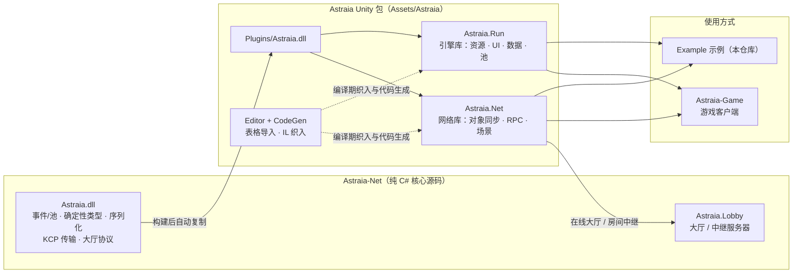

# Astraia

Astraia 是一个 Unity 客户端框架：在纯 C# 核心（Astraia-Net）之上提供 Unity 运行时封装、网络层与编辑器工具链。核心代码不依赖 Unity，客户端、服务器与游戏热更逻辑可以复用同一套类型与协议。

## 架构



> 实线表示运行时依赖，虚线表示编辑器/编译期工具链。

## 仓库组成

| 目录 | 说明 |
|---|---|
| `Assets/Astraia/Runtime/引擎库` | `Astraia.Run`：Unity 侧引擎库 |
| `Assets/Astraia/Runtime/网络库` | `Astraia.Net`：Unity 侧网络层 |
| `Assets/Astraia/Editor` | 编辑器工具与表格/脚本生成 |
| `Assets/Astraia/Plugins` | `Astraia.dll`：来自 Astraia-Net 的纯 C# 核心 |
| `Assets/Example` | 可直接运行的最小示例 |

## 核心能力

- **运行时**：AssetBundle 资源加载、场景加载、UI 管理、数据表、对象/引用池、音频、Json 持久化、`Export` 自动绑定。
- **网络**：Host / Server / Client / 在线大厅；`NetworkEntity` / `NetworkModu[README.md](README.md)le` 对象同步；`[SyncVar]`、`[ServerRpc]`、`[ClientRpc]`、`[TargetRpc]`；场景与观察者同步。
- **工具链**：Excel/表格导入并生成脚本；基于 Mono.Cecil 的 IL 织入，自动生成网络序列化与 RPC 分发代码。
- **跨端复用**：确定性类型、消息协议与传输层都来自核心 DLL，Unity 客户端与 .NET 服务器使用同一份定义。

## 快速开始

1. 使用 Unity 6000.3 或更高版本打开本仓库。
2. 打开示例场景 `Assets/Example/Scenes/AwakeScene` 并运行。
3. 在游戏工程中引用框架包：

```json
"com.charlotte.astraia": "https://github.com/1176892094/Astraia.git?path=/Assets/Astraia"
```

完整的使用示例可参考 `Assets/Example/Scripts`。

## 相关文档

- [云谷千羽](https://1176892094.github.io/) —— Astraia 与 Astraia-Net 的工程笔记、模块拆解与网络同步实践。


## 贡献者

- [Nevin](https://github.com/Molth)
